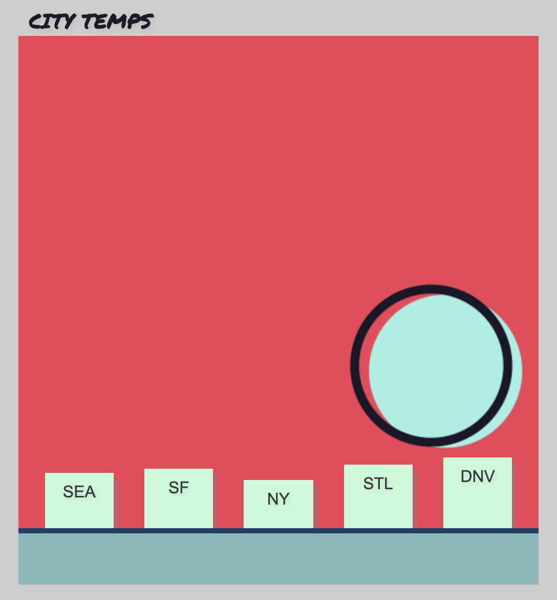
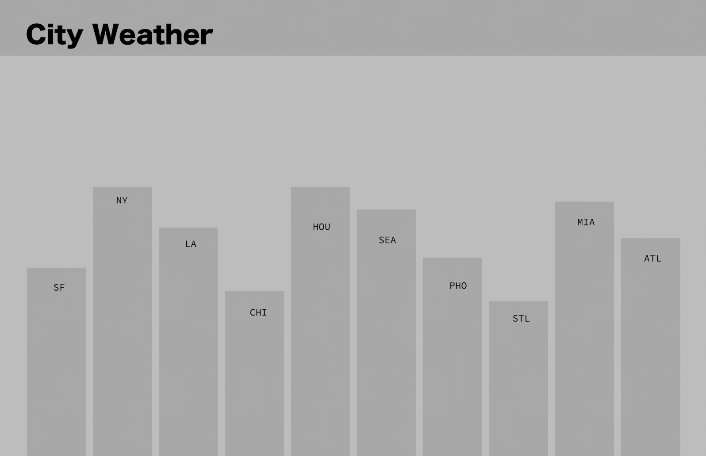

# City Weather_v2

## Current tempature in 5 major cities across the U.S. 
(ﾉ◕ヮ◕)ﾉ*:･ﾟ✧
*Pull weather data from openweathermap.org*
API info here: https://openweathermap.org/current#name

Demo: https://keegan-he.github.io/city_weather/index.html

Parameters:
id City ID
Examples of API calls:
api.openweathermap.org/data/2.5/weather?id=2172797

### API City IDs for Project: 
* Seattle: 5809844
* San Francisco: 6621230
* New York City: 5128638
* St. Louis: 6157004
* Denver: 5419384

first version of app:

original mockup:

Special shoutout to James Hazael for the cool gif.
https://dribbble.com/JamesHazael